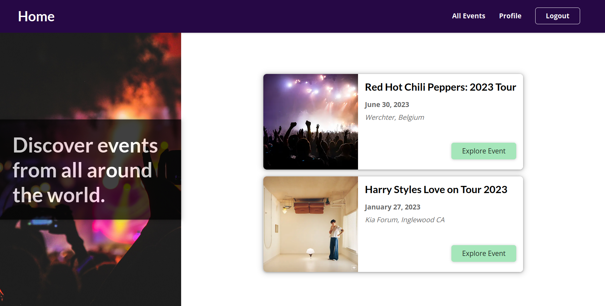
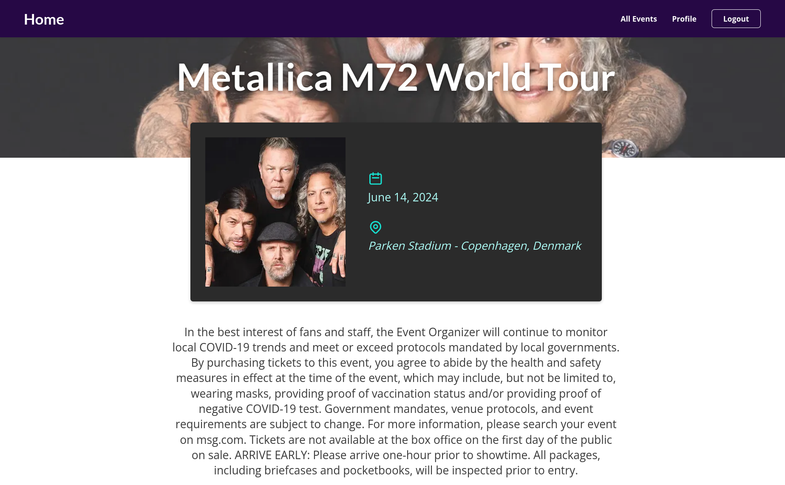
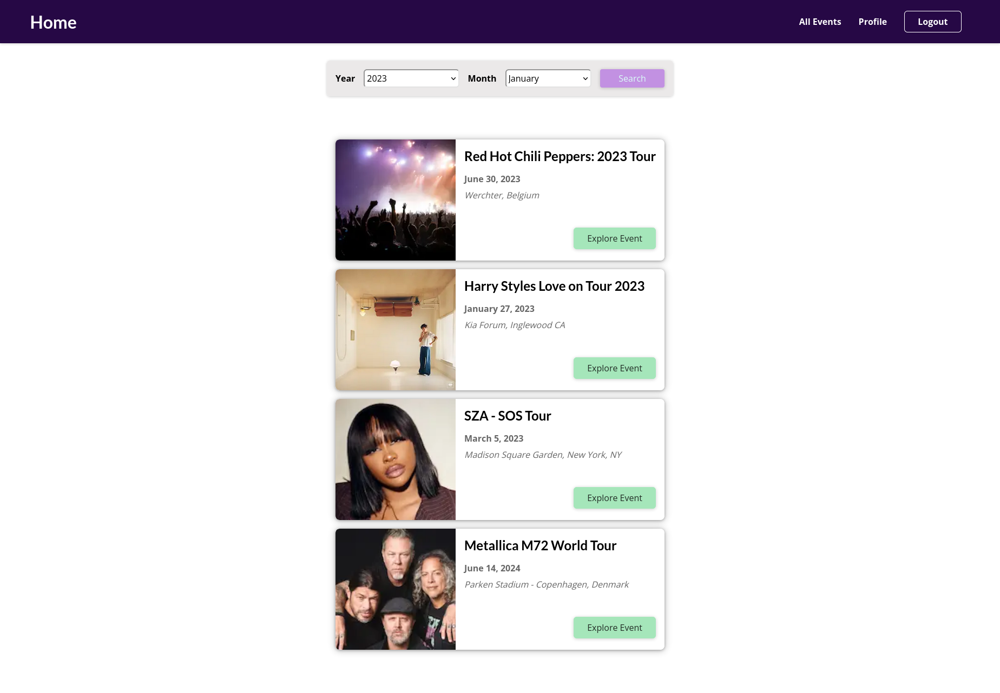
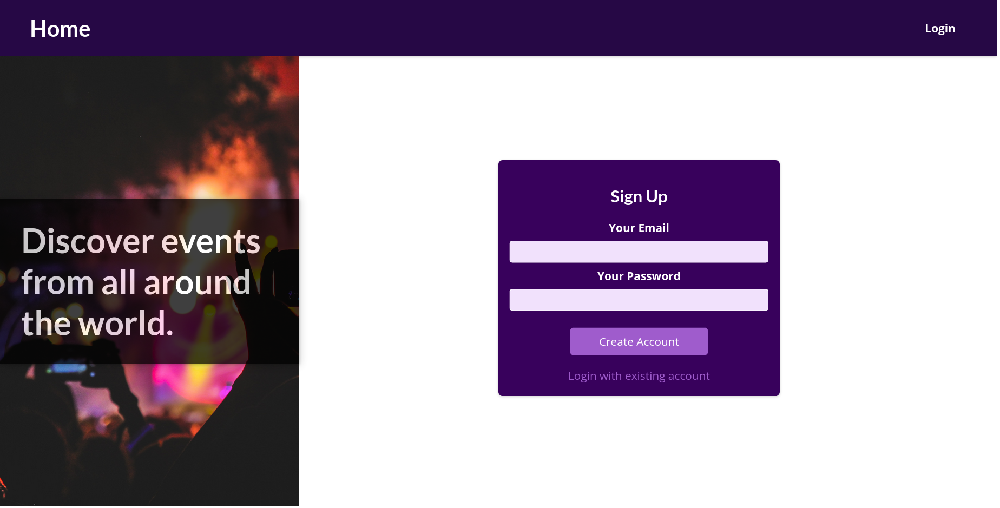
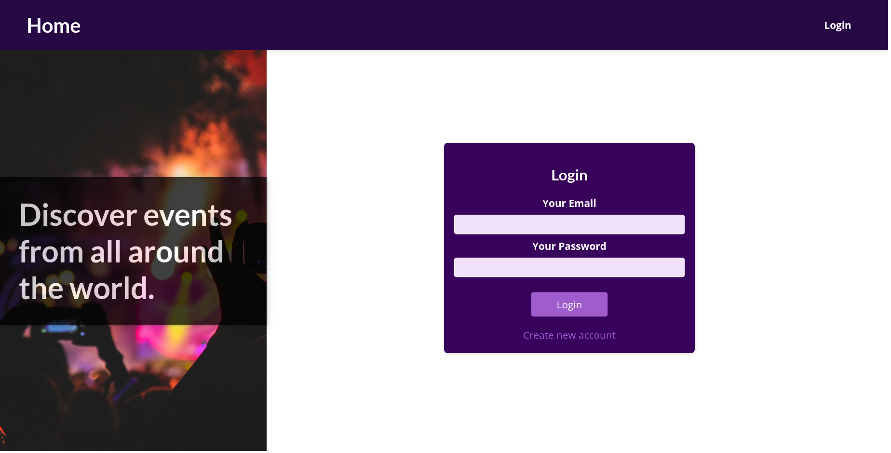
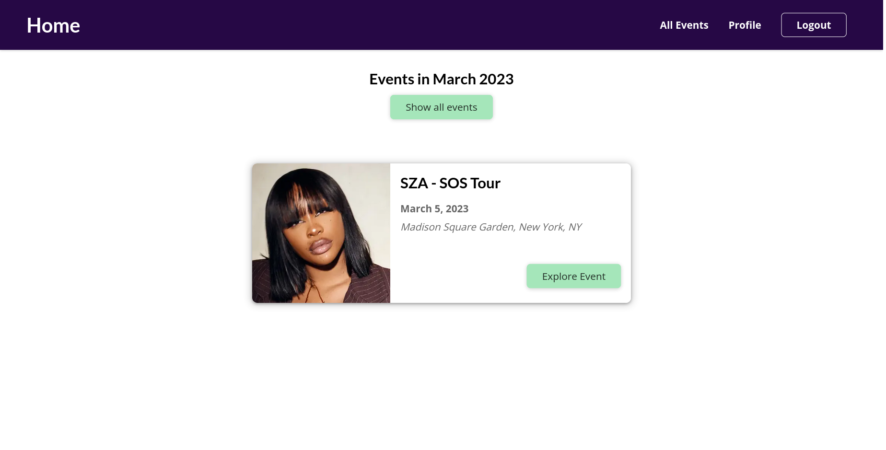
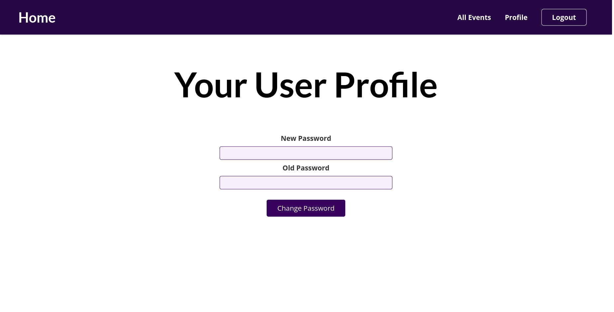

# Events App

### `Developed with Next.js, NextAuth, bcryptjs & MongoDB`

## Authentication:

- NextAuth package is used for authentication.
- User can sign up and login via e-mail.
- User can logout.
- User can change their password.
- Necessary routes are protected by checking session in getServerSideProps.

## Database:

- MongoDB is used.
- bcryptjs package is used for encrypting the passwords to store them in db.
- There are two collections for registered users and events.
- Events are fetched from the db.

## Features

- User can discover all events.
- Featured events are listed on the home page.
- Event details can be seen on its individual route.
- User can search event in some date range.

## Rendering Methods

- Static Site Generation is used to render the event detail pages.
- Static Site Generation is used to render all events.
- Server-Side Rendering is used to render filtered events according to the search params.









<br />

---

<br />
This is a [Next.js](https://nextjs.org/) project bootstrapped with [`create-next-app`](https://github.com/vercel/next.js/tree/canary/packages/create-next-app).

## Getting Started

First, run the development server:

```bash
npm run dev
# or
yarn dev
```

Open [http://localhost:3000](http://localhost:3000) with your browser to see the result.

You can start editing the page by modifying `pages/index.js`. The page auto-updates as you edit the file.

[API routes](https://nextjs.org/docs/api-routes/introduction) can be accessed on [http://localhost:3000/api/hello](http://localhost:3000/api/hello). This endpoint can be edited in `pages/api/hello.js`.

The `pages/api` directory is mapped to `/api/*`. Files in this directory are treated as [API routes](https://nextjs.org/docs/api-routes/introduction) instead of React pages.

## Learn More

To learn more about Next.js, take a look at the following resources:

- [Next.js Documentation](https://nextjs.org/docs) - learn about Next.js features and API.
- [Learn Next.js](https://nextjs.org/learn) - an interactive Next.js tutorial.

You can check out [the Next.js GitHub repository](https://github.com/vercel/next.js/) - your feedback and contributions are welcome!

## Deploy on Vercel

The easiest way to deploy your Next.js app is to use the [Vercel Platform](https://vercel.com/new?utm_medium=default-template&filter=next.js&utm_source=create-next-app&utm_campaign=create-next-app-readme) from the creators of Next.js.

Check out our [Next.js deployment documentation](https://nextjs.org/docs/deployment) for more details.
